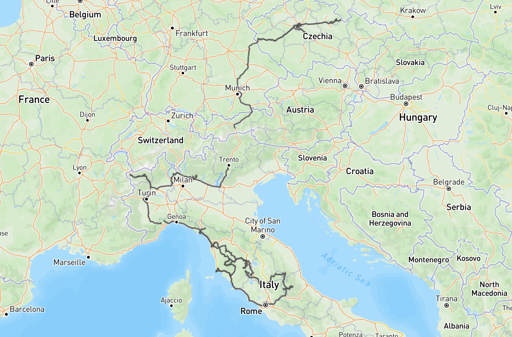

# Mojio Exporter

A simple script that, given a vehicle id and api access token, exports the vehicle's entire ride history as a geojson file to produce a visualization such as this:

I built this against the T-mobile's "[chytré auto](https://www.t-mobile.cz/chytre-auto#aplikace)" web app but if I understand it right it should work with any vendored version of the "Mojio app".

Both the vehicle id and the API token can be obtained from the developer console after logging in to the chytré auto dashboard.

The produced GeoJSON can be viewed, for instance, at [geojson.io](https://geojson.io/).
